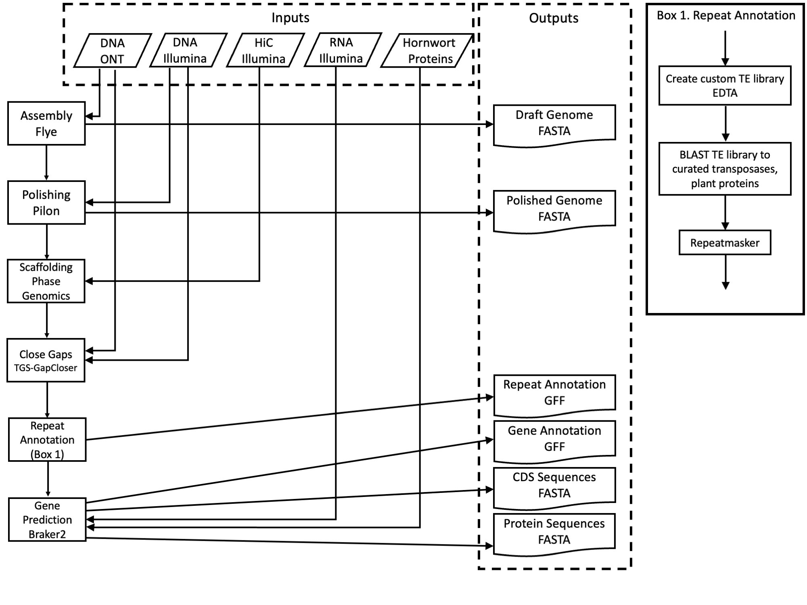

## *Anthoceros agrestis* Genome Assembly
Methods for creating updating the *Anthoceros agrestis* Oxford genome originally published in: Li, FW., Nishiyama, T., Waller, M. et al. Anthoceros genomes illuminate the origin of land plants and the unique biology of hornworts. Nat. Plants 6, 259–272 (2020). https://doi.org/10.1038/s41477-020-0618-2

Peter W. Schafran 
Boyce Thompson Institute
Ithaca, NY, USA
ps997@cornell.edu
peter@peterwschafran.com
15 September 2023

## Data

| Taxon | ONT DNA | Illumina DNA | RNA | HiC |
|-------|---------|--------------|-----|-----|
| *Anthoceros agrestis* | [SRR25338991](https://www.ncbi.nlm.nih.gov/sra/SRR25338991), [SRR10190639](https://www.ncbi.nlm.nih.gov/sra/SRR10190639), [SRR10190640](https://www.ncbi.nlm.nih.gov/sra/SRR10190640) | [SRR10250248](https://www.ncbi.nlm.nih.gov/sra/SRR10250248) | [SRR10250249](https://www.ncbi.nlm.nih.gov/sra/SRR10250249) | [SRR25366943](https://www.ncbi.nlm.nih.gov/sra/SRR25366943) |

## Graphic Overview


## Draft Assembly
Filter out ONT reads < 5kbp long.

```
awk 'BEGIN {FS = "\t" ; OFS = "\n"} {header = $0 ; getline seq ; getline qheader ; getline qseq ; if (length(seq) >= 5000 ) {print header, seq, qheader, qseq}}' < ONT.fastq > ONT_filtered.fastq
``` 

Assembly with Flye v2.8. Note metagenomic mode is invoked because it helps separate organelle genomes from nuclear and potential contaminants.

```
flye --nano-raw ONT_filtered.fastq --meta -t 24 -o draft_assembly/
```

## Polishing Assembly
Polish errors in Flye assembly with Illumina WGS data, pre-filtered with fastp v0.20.

```
fastp -i Illumina_WGS_R1.fq.gz -I Illumina_WGS_R2.fq.gz -o Illumina_WGS_R1.fastp.fq.gz -O Illumina_WGS_R2.fastp.fq.gz --detect_adapter_for_pe -5 -3 -g -w 16
```

Iteratively three times, map Illumina WGS and ONT reads to the genome and polish with Pilon v1.24.

```
bwa index draft_assembly/assembly.fasta
bwa mem -t 24 draft_assembly/assembly.fasta Illumina_WGS_R1.fastp.fq.gz Illumina_WGS_R2.fastp.fq.gz | samtools sort -o assembly.Illumina.bam
minimap2 -t 24 draft_assembly/assembly.fasta ONT_filtered.fastq | samtools sort -o assembly.ONT.bam

java -Xmx100G -jar pilon-1.24.jar --genome assembly.fasta --frags assembly.Illumina.bam --nanopore assembly.ONT.bam --output pilon
```

## Scaffolding
HiC library prep and data analysis performed by Phase Genomics (Seattle, WA).

## Gap-filling
Gaps in the scaffolded genome were filled using TGS-Gapcloser v.1.1.1. ONT reads were converted to FASTA format using the Biopython Python library, and Illumina WGS reads were concatenated into a single file. 

```
tgsgapcloser --scaff scaffolded_assembly.fasta \
    --reads ONT_reads.fasta \
    --ouput assembly.gapclosed
    --ngs Illumina_reads_combined.fastq \
    --pilon /home/ps997/bin/pilon-1.24.jar \
    --samtools /usr/local/bin/samtools \
    --java /usr/bin/java
```

## Contaminant Filtering
Potential contaminant sequences were identified with a combination of: 1) best BLASTX hits of the genome sequences compated to the NCBI *nr* database; 2) average read depth of Illumina WGS reads mapped to the genome sequences; 3) average GC content of the genome sequences. Four sequences totaling 7.7 Mb were identified as likely contaminants and removed based on BLAST hits to Actinobacteria, 72% GC content, and no coverage in the Illumina data.

## Renaming and reordering
Genome sequences were reordered from longest to shortest and numbered. The number was prepended with a species code ("AnagrOXF") and ".S" or ".C", depending on if the sequence represents a scaffold or unscaffolded contig, respectively. 

## Repeat Annotation and Masking
A custom repetitive element library was constructed with EDTA v2. The library was further filtered by BLASTX searching LTRs against a database of transposases to remove any unknown LTRs, and by BLASTX searching the library against UniProt plant proteins to remove any known plant proteins. 

```
EDTA.pl --sensitive 1 --anno 1 --evaluate 1 -t 24 --genome scaffolded_genome.contaminants_removed.renamed.fasta --repeatmasker /home/ps997/bin/RepeatMasker/RepeatMasker

extract_unknownLTR.py scaffolded_genome.contaminants_removed.renamed.fasta.mod.EDTA.TElib.fa
blastx -query scaffolded_genome.contaminants_removed.renamed.fasta.mod.EDTA.TElib.fa.LTRlib.unknown.fa -db Tpases020812 -evalue 1e-10 -num_descriptions 10 -out scaffolded_genome.contaminants_removed.renamed.fasta.mod.EDTA.TElib.fa.LTRlib.unknown.fa.blastx -num_threads 12
perl transposon_blast_parse.pl --blastx scaffolded_genome.contaminants_removed.renamed.fasta.mod.EDTA.TElib.fa.LTRlib.unknown.fa.blastx --modelerunknown scaffolded_genome.contaminants_removed.renamed.fasta.mod.EDTA.TElib.fa.LTRlib.unknown.fa
cat scaffolded_genome.contaminants_removed.renamed.fasta.mod.EDTA.TElib.fa.LTRlib.known.fa identified_elements.txt > scaffolded_genome.contaminants_removed.renamed.fasta.mod.EDTA.TElib.fa.LTRlib.known.final.fa
mv unknown_elements.txt scaffolded_genome.contaminants_removed.renamed.fasta.mod.EDTA.TElib.fa.LTRlib.unknown.final.fa

blastx -db uniprot_sprot_plants.fasta -query scaffolded_genome.contaminants_removed.renamed.fasta.mod.EDTA.TElib.fa.LTRlib.known.final.fa -out uniprot_plant_blast.out -num_threads 12
perl ProtExcluder.pl uniprot_plant_blast.out scaffolded_genome.contaminants_removed.renamed.fasta.mod.EDTA.TElib.fa.LTRlib.known.final.fa
```

RepeatMasker was used with the custom repeat library to softmask the genome.

```
/home/ps997/bin/RepeatMasker/RepeatMasker -noisy -a -gff -u -pa 6 --xsmall -lib scaffolded_genome.contaminants_removed.renamed.fasta.mod.EDTA.TElib.fa.LTRlib.known.final.fanoProtFinal scaffolded_genome.contaminants_removed.renamed.fasta
```
 
## Gene Annotation
Genes were predicted with a development version of BRAKER 3, incorporating RNA seq data and protein sequences from previously published *Anthoceros* genomes.

```
hisat2-build -p 24 masked_genome.fasta masked_genome.fasta
hisat2 -p 24 -x masked_genome.fasta -1 RNA_R1.fq.gz -2 RNA_R2.fq.gz 2> hisat-align.out | samtools sort -o masked_genome.RNAmapped.bam

braker.pl \
--genome masked_genome.fasta \
--bam masked_genome.RNAmapped.bam \
--prot_seq Hornwort_proteins.faa \
--prg=gth --gth2traingenes \
--verbosity 3 \
--cores 24 \
--nocleanup \
--softmasking \
--GENEMARK_PATH=/bin/gmes_linux_64 \
--AUGUSTUS_CONFIG_PATH=/bin/Augustus/config \
--AUGUSTUS_BIN_PATH=/bin/braker/bin/ \
--AUGUSTUS_SCRIPTS_PATH=/bin/Augustus/scripts \
1>braker.out 2>braker.err
```

Genes weres renamed with their respective genome sequence ID combined with a number incremented by 100. 


